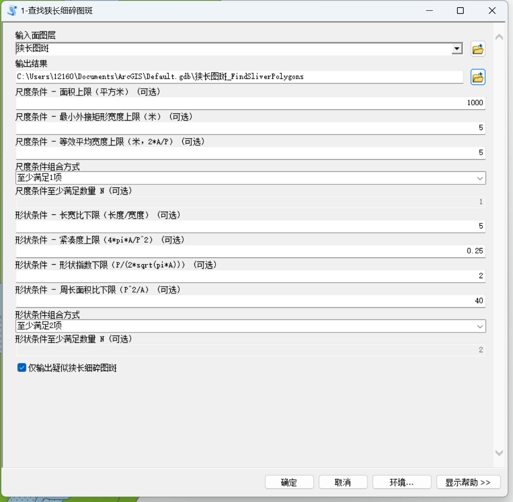
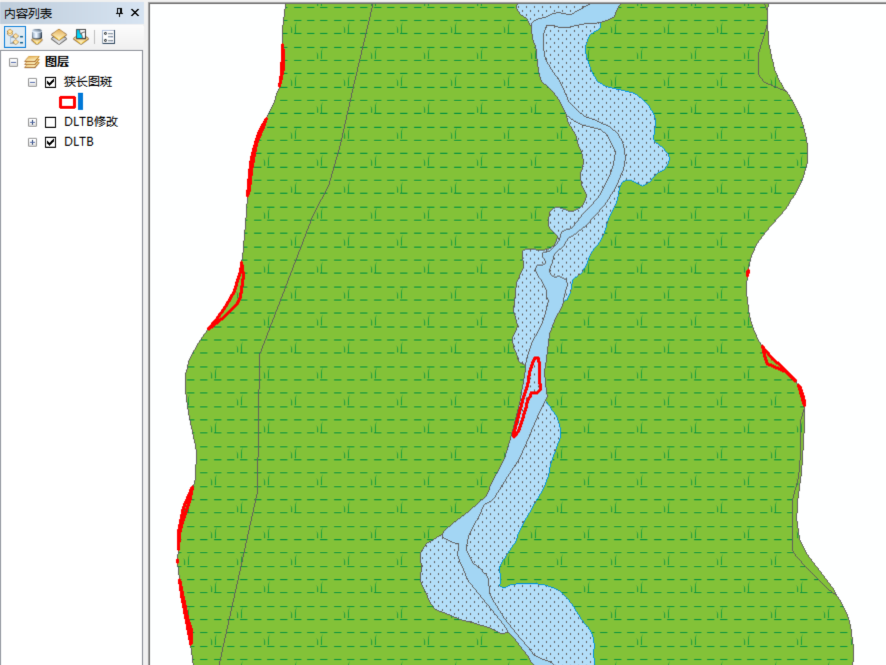
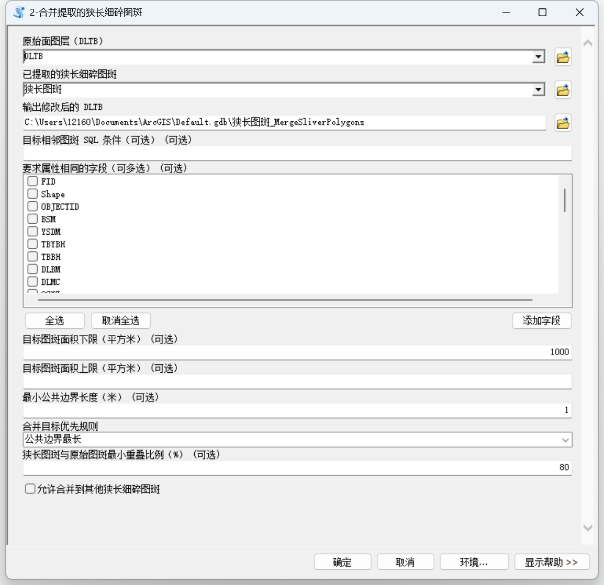
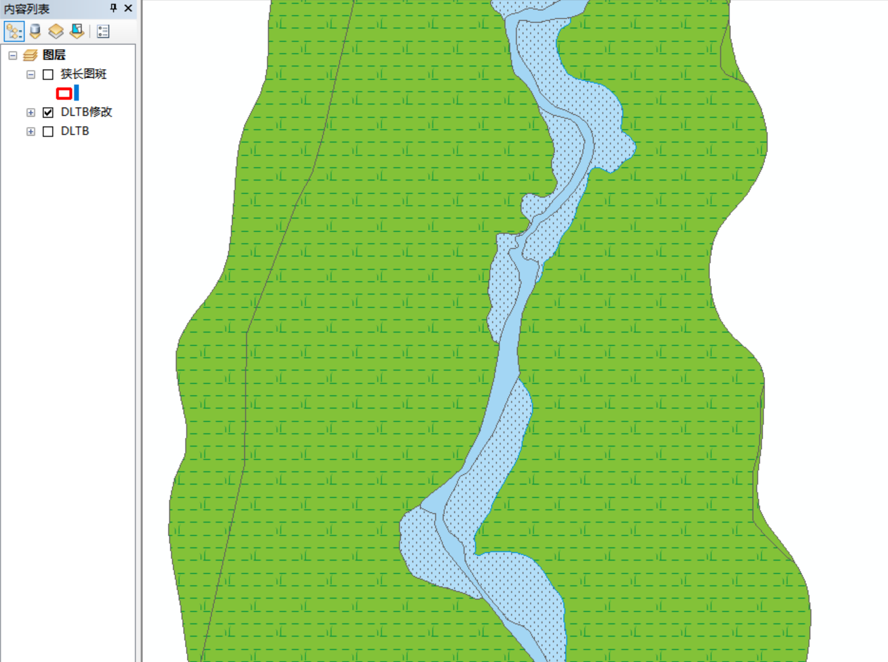

# ArcGIS 狭长细碎图斑识别与相邻合并工具

**[English](README.md) | 简体中文**

面向土地调查、地籍调查和自然资源数据整理的 **ArcGIS Desktop 10.x 狭长细碎图斑识别与相邻合并 Python Toolbox**。

当前版本 **V1.4**，包括“查找狭长细碎图斑”和“合并提取的狭长细碎图斑”两个工具。

> **源代码：** [`SliverPolygonTools_ArcGIS10x_V1.4.pyt`](SliverPolygonTools_ArcGIS10x_V1.4.pyt)  
> **运行环境：** ArcGIS Desktop 10.x / ArcMap / Python 2.7 / ArcPy

## 运行效果

<table>
  <tr>
    <td width="50%" align="center">
       
      <b>查找狭长细碎图斑参数界面</b>
    </td>
    <td width="50%" align="center">
       
      <b>狭长细碎图斑识别结果</b>
    </td>
  </tr>
  <tr>
    <td width="50%" align="center">
       
      <b>合并提取的狭长细碎图斑参数界面</b>
    </td>
    <td width="50%" align="center">
       
      <b>狭长细碎图斑合并结果</b>
    </td>
  </tr>
</table>

## 工具箱

- **1-查找狭长细碎图斑**
- **2-合并提取的狭长细碎图斑**

## 主要功能

### 1. 查找狭长细碎图斑

工具采用“**尺度条件 + 形状条件**”两级判定方式。

**尺度条件**
- 图斑面积
- 最小外接矩形宽度
- 等效平均宽度：`2 × 面积 ÷ 周长`

**形状条件**
- 长宽比：`L / W`
- 紧凑度：`4πA / P²`
- 形状指数：`P / (2√(πA))`
- 周长面积比：`P² / A`

只有尺度条件和形状条件同时满足设定要求，才判定为疑似狭长细碎图斑，可减少大型河流、道路等正常狭长地物的误识别。

### 2. 合并提取的狭长细碎图斑

合并工具采用两个输入：

1. **原始面图层（DLTB）**
2. **已经提取并人工确认的狭长细碎图斑**

工具先将提取图斑与原始 DLTB 进行空间匹配，再分析邻接关系，并依据公共边界长度、目标面积、属性一致性等条件选择合并目标，最终输出修改后的完整 DLTB。

支持：
- 公共边界最长
- 目标面积最大
- 目标面积最小
- 属性字段一致
- 目标面积范围
- 最小公共边界长度
- 狭长图斑与原始图斑最小重叠比例

## 推荐流程

`原始 DLTB → 批量识别 → 人工复核 → 相邻合并 → 输出修改后的完整 DLTB`

建议将自动识别结果作为疑似对象，人工确认后再进行批量合并。

## 默认参数

### 查找工具

| 参数 | 默认值 |
|---|---:|
| 面积上限 | 1000 ㎡ |
| 最小外接矩形宽度上限 | 5 m |
| 等效平均宽度上限 | 5 m |
| 尺度条件 | 至少满足 1 项 |
| 长宽比下限 | 5 |
| 紧凑度上限 | 0.25 |
| 形状指数下限 | 2 |
| 周长面积比下限 | 40 |
| 形状条件 | 至少满足 2 项 |

### 合并工具

| 参数 | 默认值 |
|---|---:|
| 目标图斑面积下限 | 1000 ㎡ |
| 最小公共边界长度 | 1 m |
| 合并目标优先规则 | 公共边界最长 |
| 与原始图斑最小重叠比例 | 80% |
| 允许合并到其他狭长图斑 | 否 |

以上为初始默认值，并不是固定业务标准。实际项目中应结合数据尺度、图斑特征和业务要求调整。

## 使用方法

1. 下载 `SliverPolygonTools_ArcGIS10x_V1.4.pyt`。
2. 打开 ArcMap。
3. 在 ArcToolbox 或 Catalog 中选择 **Add Toolbox（添加工具箱）**。
4. 选择 `.pyt` 文件。
5. 打开“狭长细碎图斑处理工具箱 V1.4”。

## 运行环境

- ArcGIS Desktop 10.x / ArcMap
- Python 2.7
- ArcPy
- 输入数据为面要素
- 涉及米和平方米阈值时，建议使用米制投影坐标系

## 注意事项

- 工具不会直接修改原始输入数据，而是生成新的输出数据。
- 批量处理前建议选取代表性区域测试阈值。
- 如需保持地类、权属等属性一致，可在“要求属性相同的字段”中选择相应字段。
- 未找到符合条件合并目标的狭长图斑将保留原状。
- 狭长细碎图斑不存在适用于所有项目的统一阈值，应结合具体数据确定。

## 更新记录

详见 [CHANGELOG.md](CHANGELOG.md)。

## 许可证与版权

Copyright (c) 2026 Zhang Y.H.

本项目采用 **GNU General Public License v3.0 (GPL-3.0)**，详见 [LICENSE](LICENSE)。

ArcGIS、ArcMap、ArcPy 为 Esri 相关产品或技术名称，本项目与 Esri 无隶属或官方合作关系。

## 关注与交流

欢迎关注微信公众号 **测绘地信**，也可访问知识星球 **测绘地理信息共享中心**。

<table>
  <tr>
    <th width="50%">微信公众号 测绘地信</th>
    <th width="50%">知识星球 测绘地理信息共享中心</th>
  </tr>
  <tr>
    <td align="center" valign="middle"></td>
    <td align="center" valign="middle"></td>
  </tr>
</table>

## 作者

**Zhang Y.H.** · GitHub [@zhangyhrs](https://github.com/zhangyhrs)

相关工具：[SHP2KMZ Tool](https://github.com/zhangyhrs/SHP2KMZ_Tool) · [GeoStar Selector for QGIS](https://github.com/zhangyhrs/GeoStar-Selector-QGIS)
